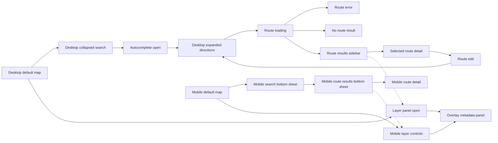

# Figma Search And Routing Flow Map

Issues: MBR-59, MBR-74
Milestone: Figma + Design System Planning
Verified: 2026-05-22 on `feature/velorail-frontend-redesign-google-maps-parity`
Scope: Figma-ready flow planning only. No production UI code, routing behavior, route data contract, or final visual signoff changed.

## Source Inputs

- `docs/frontend/current-frontend-inventory.md`
- `docs/frontend/current-search-route-entry-flow.md`
- `docs/frontend/current-route-results-contracts.md`
- `docs/frontend/current-map-overlays-browser-coverage.md`
- `docs/frontend/google-maps-ux-api-research.md`
- `docs/frontend/google-maps-search-places-research.md`
- `docs/frontend/google-maps-directions-route-results-research.md`
- `docs/frontend/google-maps-mobile-controls-panels-research.md`
- `src/components/Search/`
- `src/components/Results/`
- `src/components/Map/`
- `src/stores/routeStore.ts`, `src/stores/uiStore.ts`, and `src/stores/mapOverlayStore.ts`

## Flow Summary

Primary route flow:

```text
Loaded map -> collapsed destination search -> autocomplete -> expanded directions when origin is needed -> route loading -> route results -> selected route detail -> route edit
```

Secondary flow branches:

```text
Autocomplete loading/error/empty -> field resolution error -> route calculation error -> no route result
Loaded map -> layer panel -> overlay toggle or legend -> overlay metadata
Mobile map -> search sheet -> route results sheet -> route detail sheet
Mobile map -> compact layer control -> layer sheet -> metadata sheet
```

## FigJam Mermaid Source

This Mermaid source is suitable for regenerating an editable FigJam flow once a Figma plan or target board is available.



## Required Figma Frames

| Frame | Owner components | Required state | Figma requirements |
| --- | --- | --- | --- |
| Desktop default map | `App`, `MapContainer`, `MapOverlayRenderer` | Google Maps loaded, `selectedRoute=null`, `sidebarOpen=false`, `searchMode` can be collapsed, current transit layer on, other overlays default off. | Show the map as the primary surface, preserve Google controls and attribution zones, keep VeloRail overlays absent unless explicitly toggled. |
| Desktop collapsed search | `SearchCard`, `PlaceAutocomplete`, `LocationStatus` | `uiStore.searchMode="collapsed"`, destination field visible, location status visible, route results closed. | One stable search card at top left. Destination-first entry must make the missing-origin path obvious without making driving primary. |
| Desktop expanded directions | `SearchCard`, `PlaceAutocomplete`, `TimeSelector`, `ModeSelect`, `BikeSettings` | `searchMode="expanded"`, start and destination fields editable, mode/time/safety controls visible. | Direction-entry frame must include origin, destination, current-location action, mode context, safety control, time control, and later space for swap/clear actions. |
| Autocomplete open | `PlaceAutocomplete`, `geocoding.ts` service boundary | `isFocused=true`, query length at least 2, `isLoading`, `results`, `highlightedIndex`; no-result and service-error states planned. | Show prediction hierarchy with primary name and secondary context. Include loading, error, and visible no-results rows even though current no-results markup is hidden by `isOpen` behavior. |
| Route loading | `SearchCard`, `ResultsSidebar`, `useRouting` | `isResolvingPlaces=true` or `routeStore.isLoading=true`, possible `searchMessage`. | Show field lookup and route calculation as distinct states. Keep map visible and avoid implying route data before results exist. |
| Route error | `SearchCard`, `ResultsSidebar` | `routeStore.error` from geocode failure, validation failure, or routing failure. | Error should be near the responsible field when possible and available in the results surface when route calculation fails. Include `role="alert"` intent and recovery action. |
| No route result | `SearchCard`, `useRouting`, `ResultsSidebar` | `compareRoutes` returns `[]`; today `useRouting` closes the sidebar and sets a route error. | Provide a clearer no-route result frame instead of relying only on search feedback. Do not invent route alternatives or future routing. |
| Route results sidebar | `ResultsSidebar`, `RouteOption`, `RouteOverlay` | `sidebarOpen=true`, `routes.length > 0`, selected route usually first result. | Duration-first route cards, Bike + Rail and Walk + Rail as first-class, Driving framed as comparison-only, selected route synchronized with map line. |
| Selected route detail | `RouteDetails`, `VehicleTrackingStatus`, `RouteOverlay` | `selectedRoute` set, details render for current safe fields only. | Leg-level itinerary with mode icon, instruction, endpoints, distance, duration, transit line, headsign, wait/delay/safety only when present. No fare, platform, alerts, exact arrivals, unsupported live ETA, or turn-by-turn maneuvers. |
| Layer panel open | `MapContainer`, `ToggleChip`, `mapOverlayStore`, `mapOverlayRegistry` | Overlay visibility from store, comparison mode, legend open or closed. | Group controls by Current, Future, Visionary, Nationalized Rail Planning, and bike context. Active state must not rely on color alone. Long copy should move to expanded rows or metadata. |
| Overlay metadata panel | `MapContainer`, `mapOverlayRegistry` | `selectedOverlayMetadata` populated from `velorail:map-overlay-metadata-selected`. | Show badge, title, subtitle, status, classification, confidence, uncertainty, details, disclaimer, sources, and accessed dates. Make clear that Google Maps renders the geometry but is not the data source for future, visionary, freight, or conversion claims. |
| Mobile default map | `App`, `MapContainer`, `SearchCard`, `ResultsSidebar` responsive CSS | 390 by 844 and 430 by 932 planning viewports, route sheet closed or minimized. | Map remains first. Search and compact controls must avoid Google controls and attribution. Layer controls should not occupy bottom space by default. |
| Mobile search bottom sheet | `SearchCard` planned responsive variant | Planned state; current app still uses top search card on mobile. | Represent route entry as a mobile sheet with visible origin/destination fields, clear/swap space, current-location action, autocomplete, and keyboard-safe layout. Mark as planned, not current behavior. |
| Mobile route results bottom sheet | `ResultsSidebar` responsive CSS, future sheet coordinator | Current state is open/closed; planned states are collapsed, half, full. | Define collapsed route summary, half route options, and full route detail states. Closing should minimize where appropriate, not always clear `selectedRoute`. |
| Mobile route detail | `RouteDetails` within full route sheet | `selectedRoute` set and full sheet state active. | Itinerary occupies full sheet state. Keep map context and selected route visible through fit padding. Use only current safe route fields. |
| Mobile layer controls | `MapContainer`, `mapOverlayStore`, `mapOverlayRegistry` | Planned compact entry plus expanded layer sheet or popover. | Compact Layers control opens a sheet that does not compete with route results and metadata. Preserve layer grouping, active counts, legend, notices, and source/provenance access. |

## State And Code Mapping

| State area | Current owner | Figma annotation requirement |
| --- | --- | --- |
| Map load and error | `App.tsx` | Note Google Maps key/library dependency and map load failure frame if captured later. |
| Search collapsed/expanded | `uiStore.searchMode`, `SearchCard` | Annotate collapsed destination-only behavior and expanded directions behavior. |
| Selected place vs raw input | `SearchCard`, `PlaceAutocomplete`, `routeStore.searchParams` | Mark unresolved typed input separately from selected/resolved location. |
| Autocomplete predictions | `PlaceAutocomplete`, `geocoding.ts` | Show loading, results, highlighted option, no results, service error, and keyboard semantics. |
| Route calculation | `useRouting`, `routing.ts`, `googleRoutesService.ts` | Route loading frame must not imply returned data before `routes` exists. |
| Route results | `routeStore.routes`, `ResultsSidebar`, `RouteOption` | Route cards may show only current `Route` fields. Selection by label is fragile and must be annotated before same-mode alternatives are designed. |
| Selected route overlay | `RouteOverlay`, `MapContainer` | Selected route remains above scenario overlays and drives viewport fit. |
| Layer controls | `mapOverlayStore`, `MapContainer` | Overlay visibility and comparison mode stay store-owned. |
| Overlay metadata | `mapOverlayRegistry`, metadata event, `MapContainer` | Metadata must preserve source, uncertainty, classification, confidence, and disclaimer. |
| Mobile panels | CSS today, future UI coordinator | Mark collapsed/half/full as planned state work, not current implementation. |

## Figma Notes

- Keep dense API limitations and unsupported route fields as side annotations, not in the primary frame body.
- Use component labels that match repo owners so implementation issues can trace each frame to files.
- Use one component set for route cards with selected, future, loading-adjacent, and comparison-only annotations.
- Use one sheet component set for mobile search, route results, route detail, layer controls, and metadata, but annotate which sheets are persistent versus modal.
- Include a frame note that future, visionary, freight, and converted passenger overlays are VeloRail-owned planning data rendered through Google Maps primitives.

## Out Of Scope For This Flow Map

- No Google same-mode alternatives as current behavior.
- No multi-stop route entry.
- No fare, platform, alerts, crowding, accessibility status, exact arrival time, or turn-by-turn step display.
- No treating future routes or overlays as current Google Maps transit service.
- No framework migration or final Figma production signoff.
